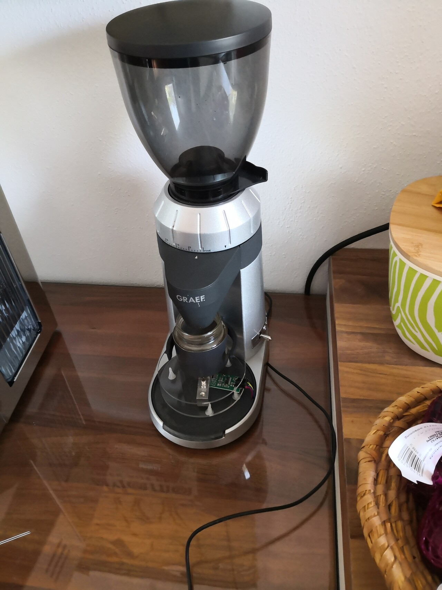
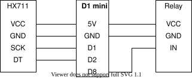
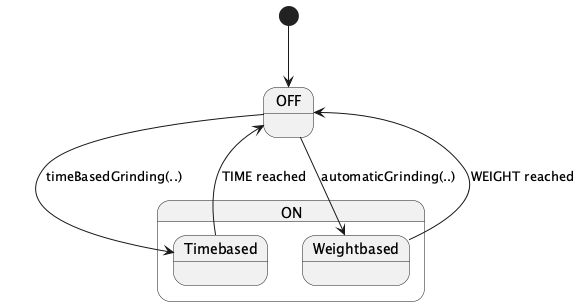
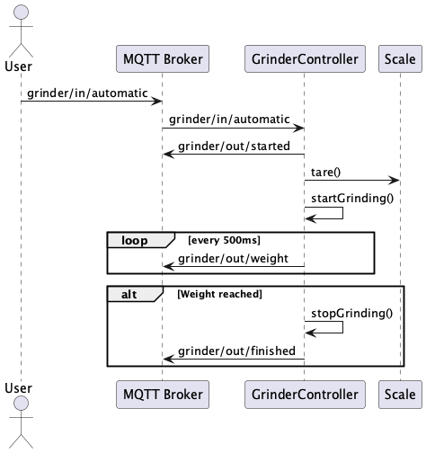

<!-- https://jerey.at/coffee-automation -->

# Coffee Automation

<div style="display: table; width: 100%;">
  <div style="display: table-row">
    <div style="display: table-cell; vertical-align: middle;">
      
    </div>
    <div style="display: table-cell; vertical-align: middle;">
      <ul>
        <li>Automation of a coffee grinder</li>
        <li>C++ / ESP8266 Wi-Fi module</li>
        <li>Created in 2020</li>
        <li><a href="https://github.com/Jerey/coffee-automation">GitHub</a></li>
      </ul>
    </div>
  </div>
</div>
Anton Jerey

----

## Automation Options

- **Time-Based Grinding** - Runs for a set duration.
- **Weight-Based Grinding** - Stops when target weight is reached.


---

## Introduction

- I like coffee - Lelit Mara X
- Good Espresso
  - Coarseness, Timing, Amount, ...
  - Input / Output Ratio
- Bean amount important
  - Time-based grinders
  - Weight-based grinders
  - ... mine offered neither

----

### What is this project?

- Automates the weighing of the ground coffee
- Can be added to any coffee grinder*
- Provides precise grinding control (time-based & weight-based)
- Flexible UI due to MQTT

> \* with an on/off switch

----

### Why does it matter?

- Same amount improves repeatability
- Reduces manual effort
- Almost "removes" the grinding step
- Can be integrated into IoT

---

## System Overview



> Kept minimal for experts only -> power outlet electricity

----

### Hardware Components

- **D1 Mini (ESP8266)** - Controller of the scale and relay
- **Relay Module** - Controls the power of the grinder
- **Load Cell + HX711** - Measures the ground coffee

----

### Software & Communication

- **ESP8266 Firmware (C++)** - Controls the automation logic
- **MQTT Protocol**
  - Common IoT protocol -> Great number of available integrations
  - Broker is required
  - Publish and subscribe model
  - Quality of Service levels
  <!-- - **Node-RED Dashboard (Optional)** - Web-based user interface
  - **CLI Tool Alternative (Optional)** - `mosquitto_pub -t grinder/in/start -n`
  - **...** -->

---

## Key Parts of the Codebase



----

### MQTT Communication

- Separates the user interface from the controller
- Subscribed topics end up here:

```cpp[|4,5]
// byte and uint used for parameter communication
void callback(char* topic, byte*, unsigned int) {
    /* .. */
    else if (strcmp(topic, "grinder/in/tare") == 0) {
        scale.tare(5);
    }
    /* .. */
}
```

----

### Grinder Control

- Uses GPIO pins to control a relay
- Relay turning the grinder on and off

```cpp[|3|5-8|9]
void GrindingController::startGrinding(
                  unsigned int timeToGrind) {
  auto startingTime = millis();

  while (millis() - startingTime < timeToGrind) {
    digitalWrite(relay, HIGH);
    getCurrentWeightAndPublish();
  }
  digitalWrite(relay, LOW);
}
```

----

### Load Cell Integration

- Reads weight from HX711 ADC
- Load cell placed under the outlet

```cpp[|2]
float GrindingController::getCurrentWeight() {
  return scale.get_units(1);
}
```

----

### [Weight-based Grinding](https://github.com/Jerey/coffee-automation/blob/f62142d689d115cbf7541daf6f7284798d2f38ee/lib/CoffeeAutomation/GrindingController.cpp#L78-L102)



---

## Challenges

- **Time to Scale**
  - Ground beans travel time to scale
  - Retention of the grinder
- **MQTT Topics**
  - Many of them
  - Proper naming is hard
- **Testing**
  - PlatformIO (Development environment)
  - Mostly manual
- **Coffee Consumption**

---

## Future Enhancements

- **Time to Scale** - Remember the really required threshold
- **Simple Controls** - Add physical controls
- **Energy Efficiency** - Make use of deep sleep
  - OTA challenges
  - Wake up challenges
- **Further Refactoring**

---

## Q & A

[Optional Demo](https://youtube.com/shorts/JVY1KFqSwoU?feature=share)
